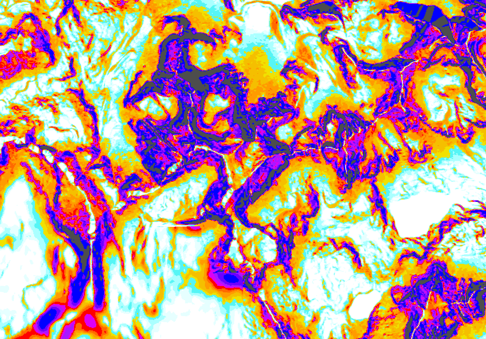
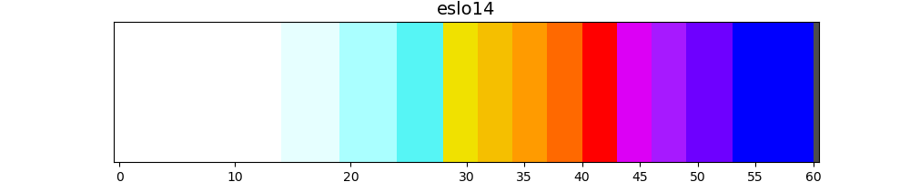

# E.Slope

Enhanced slope overlays for the alps, to use for hiking, ski-touring, alpinism, ...

<figcaption style="background-color: #222; color: #fff; font: italic smaller sans-serif; padding: 3px; text-align: center">
E.Slope around Mont Malinvern.  
Note the lower precision of the french side (bottom-left)
</figcaption>

# Status
Downloads are available. Tile hosting is available, but stability is not guaranteed.

# Palette used
 
For a discussion of the design process behind this palette, and a comparison, see [geo-slope-color-palette](https://github.com/eddy-geek/TIL/blob/master/202105-geo-slope-color-palette.md).

# How to use the maps online?

* Online
  * Head to [WTracks](https://opoto.github.io/wtracks/) and in the layer control (top-right), tick *EU: E.Slopes* (pending [wtracks#21](https://github.com/opoto/wtracks/pull/21))
  * Or configure your tool of choice with the correct URL. The Leaflet URL is `http://www.montagne.top/tile/eslo14_walps/{z}/{x}/{y}.png`

# How to use the maps offline?

* You need an app supporting mbtiles:
  * For Android, options include **[AlpineQuest](https://alpinequest.net/)** *(~10€ on [play store](https://play.google.com/store/apps/details?id=psyberia.alpinequest.full))*  ; **OruxMaps** *(free [online](https://www.oruxmaps.com/cs/en/more/downloads) ; 4€ on [play store](https://play.google.com/store/apps/details?id=com.orux.oruxmapsDonate&hl=en&gl=US))* ; [Locus](https://www.locusmap.app/) ; and more.
  * For iphone, [MBTiles GPS](https://apps.apple.com/us/app/mbtiles-gps/id592703465) (untested)
  * On the PC, I haven't found simple viewers that support layers. [QGIS](https://qgis.org/) is way too complex for this task. [GPXSee](http://gpxsee.org/) is an excellent viewer, but single-layer. Maybe [ape@map](https://lic.apemap.at/cms/index.php?page=productdownload) (German, untested)
* Download the latest mbtiles file, currently [oslos-Lausanne-Jouques-Sanremo-Zermatt.mbtiles](https://drive.google.com/file/d/1c8HcLZ1Cc-I0w53eDh6hN1K31yHVWvb9/view?usp=sharing)
* Configure the app to use it:
  * For AlpineQuest, [import as file-based map](https://alpinequest.net/en/help/v2/maps/file-based-select), use "Add as Layer". [Then set opacity](https://alpinequest.net/en/help/v2/maps/change-opacity#how_to_modify_the_opacity_of_a_map_or_layer) to ~50% and *Layer Blending Mode* (💧icon) to "Multiply".
  * For OruxMap, place it in the correct folder, something like /sdcard/oruxmaps/mapfiles and follow [manual](https://www.oruxmaps.com/cs/en/manual)

# How to web-host the tiles

Check the upcoming dedicated [Hosting.md](Hosting.md).
I use go-pmtiles, but many alternatives exist including [MapTiler tileserver](https://github.com/maptiler/tileserver-gl).

# Coverage & Data

The area covered currently is *a part of* the western alps, in GPS terms from lower-left [43.580 N 5.625 E](https://www.openstreetmap.org/?lat=43.580&lon=5.625&zoom=15) to upper-right [46.558 N 7.734E](https://www.openstreetmap.org/?lat=46.558&lon=7.734&zoom=15), or as a mnemonic, Lausanne-Jouques-Sanremo-Zermatt. Some (lower elevation) areas are not covered.

### Zoom-levels:
* **Only [zoom-level](https://wiki.openstreetmap.org/wiki/Zoom_levels) 16 is provided** so far. Other levels are filled white to avoid artifacts. It means an actual **pixel resolution of 1.7 meters** at 45° *(`=2.387*78.648/111.321`)*.
* This is a deliberate choice to avoid cluttering lower zoom-level, but can be improved.
* Level 17 would bring improved resolution under 1m/px, but at a big cost in storage space, and without the corresponding quality increase, since most available data is at around 5m resolution.

### Data sources:

*W/C/E stands for Western / Central /Western Alps*

| Dataset      | W | C | E | Res | Projection        | Official Dataset | DTM.tif (*GB*) | Doc / WebGIS |
| --           | - | - | - |--  |  --                | --               | --             | --           |
| FR:IGN       | ✓ | - | - |5/40m| `2154` Lambert93  | [RGE ALTI 5m][1]                                   | [ignalps_dtm.tif] *4*   | [geoservices.ign.fr][1] / [geoportail.gouv.fr][2] |
| IT:Piemont   | ✓ | ✓ | - |  5m | `32632` WGS84/32N | [RIPRESA AEREA ICE 2009-2011 - DTM 5][3]           | <!--TODO-->             | [geoportale.piemonte.it][3] |
| IT:Aoste     | ✓ | ✓ | - |  2m | `23032` ED50/32N  | [DTM 2005 / 2008 aggregato][5]                     | <!--TODO-->             | [geoportale.regione.vda.it][5] |
| CH:SwissTopo | - | ✓ | - |  2m | `2056` LV95/LN02  | [swissALTI3D][7]                                   | [chc_dtm.tif] *18*      | [swisstopo.admin.ch][7] / [map.geo.admin.ch][8] |
| IT:Lombardia | - | ✓ | - |  5m | `32632` WGS84/32N | [DTM 5X5 - Modello digitale del terreno 2015][15]  | [lombardia_dtm.tif] *1* | [geoportale.regione.lombardia.it][15] |
| IT:Trentino  | - | ✓ | ✓ |1/2m | `25832` ETRS89/32N | [LiDAR PAT 2014 integrato con voli 2018][9]       | [trento_dtm.tif] *18*   | [territorio.provincia.tn.it][9] / [siat.provincia.tn.it][10] |
| IT:Sud-Tyrol | - | ✓ | ✓ |2.5m | `25832` ETRS89/32N | [Digitales Geländemodell Südtirols (DGM 2,5m)][11]| [styrol_dtm.tif] *2*    | / [geokatalog.buergernetz.bz.it][11] |
| DE:Bavaria   | - | - | ✓ | 50m | `25832` ETRS89/32N | [Digitales Geländemodell 50 m Gitterweite][12]    |  [bavaria_dtm.tif] *0.2* | |
| AT:Tyrol     | - | ✓ | ✓ |  5m |`31254` MGI/AustriaW| [Digitales Geländemodell Tirol, 5m][13]           | [tyrol_dtm.tif] *1* | [tirol.gv.at][13] / [tiris.maps.arcgis.com][14]
| AT:Salzburg  | - | - | ✓ |  5m ||||
| AT:Vorarlberg| - | - | ✓ |  5m |`31254` MGI/AustriaW| | | [data.vorarlberg.gv.at][15] / [vogis.cnv.at][16] |

[1]: https://geoservices.ign.fr/documentation/diffusion/telechargement-donnees-libres.html#rge-alti-5m
[2]: https://www.geoportail.gouv.fr/carte/
[3]: http://www.geoportale.piemonte.it/geonetworkrp/srv/ita/metadata.show?id=2552&currTab=rndt
[5]: https://geoportale.regione.vda.it/download/dtm/
[7]: https://www.swisstopo.admin.ch/en/geodata/height/alti3d.html
[8]: https://map.geo.admin.ch
[15]: https://www.geoportale.regione.lombardia.it/metadati?p_p_id=detailSheetMetadata_WAR_gptmetadataportlet&p_p_lifecycle=0&p_p_state=normal&p_p_mode=view&_detailSheetMetadata_WAR_gptmetadataportlet_uuid=%7BFC06681A-2403-481F-B6FE-5F952DD48BAF%7D
[9]: http://www.territorio.provincia.tn.it/portal/server.pt/community/lidar/847/lidar/23954
[10]: https://siat.provincia.tn.it/stem/
[11]: http://geokatalog.buergernetz.bz.it/geokatalog/
[12]: https://www.govdata.de/suchen/-/details/digitales-gelandemodell-50-m-gitterweite
[13]: https://www.tirol.gv.at/sicherheit/geoinformation/geodaten/laserscandaten/
[14]: https://tiris.maps.arcgis.com/apps/webappviewer/index.html?id=5e3071044cb44e76843d110baef8b138
[15]: https://data.vorarlberg.gv.at/ogd/geographieundplanung/laserscanning-dhm.shtm
[16]: http://vogis.cnv.at/atlas/init.aspx?karte=planung_und_kataster

[bavaria_dtm.tif]: https://dtmlocal.s3.fr-par.scw.cloud/bavaria_dtm.tif
[chc_dtm.tif]: https://dtmlocal.s3.fr-par.scw.cloud/chc_dtm.tif
[lombardia_dtm.tif]: https://dtmlocal.s3.fr-par.scw.cloud/lombardia_dtm.tif
[styrol_dtm.tif]: https://dtmlocal.s3.fr-par.scw.cloud/styrol_dtm.tif
[trento_dtm.tif]: https://dtmlocal.s3.fr-par.scw.cloud/trento_dtm.tif
[tyrol_dtm.tif]: https://dtmlocal.s3.fr-par.scw.cloud/tyrol_dtm.tif
[ignalps_dtm.tif]: https://dtmlocal.s3.fr-par.scw.cloud/ignalps_dtm.tif
<!-- [aoste_dtm.tif]: https://dtmlocal.s3.fr-par.scw.cloud/aoste_dtm.tif -->
<!-- [piemont_dtm.tif]: https://dtmlocal.s3.fr-par.scw.cloud/piemont_dtm.tif -->

* *France*: [RGE ALTI 5m](https://geoservices.ign.fr/documentation/diffusion/telechargement-donnees-libres.html#rge-alti-5m). Mostly based on Radar, with a "real" resolution closer to 30m. ⚠️ Only *departement*s n° 04 05 06 38 73 74
* *Italy>Piemonte*: *RIPRESA AEREA ICE 2009-2011 - DTM 5*, hosted [here](http://www.geoportale.piemonte.it/geonetworkrp/srv/ita/metadata.show?id=2552&currTab=rndt)
* *Italy>Aosta*: [DTM 2005 / 2008 aggregato](https://geoportale.regione.vda.it/download/dtm/)
* *Switzerland*: [SwissAlti3D](https://www.swisstopo.admin.ch/en/geodata/height/alti3d.html)
* *Austria*: [Geoland Geländemodell 10m](https://www.data.gv.at/katalog/dataset/b5de6975-417b-4320-afdb-eb2a9e2a1dbf)

For details on the data wrangling process: [IGN-data-gdaldem](https://github.com/eddy-geek/TIL/blob/master/202101-IGN-data-gdaldem.md)

# Links
* [openslopemap.org](https://www.openslopemap.org/). E.Slope is very similiar in spirit, but with more focus on model precision for the western alps, different technical and aesthetical choices, and an open development process. Kudos to the OpenSlopeMap team for the inspiring work!

* A tutorial for Austrian elevation data: [terrain-rgb](https://github.com/syncpoint/terrain-rgb)
* Hosting [tiling-notes](https://gist.github.com/smnorris/4866ac1c17a37cab907d11d20de491dc)

# License

The code in this repository is under [CC 1.0](LICENSE).
The elevation data is under specific open licenses:
- Western Alps:
  * <a href='https://geoservices.ign.fr/cgu-licences'>IGN</a>
  * <a href='http://www.datigeo-piem-download.it/direct/Geoportale/RegionePiemonte/Licenze/New/Licenza_CC40BY.pdf'>GeoPiemonte</a>
  * <a href='https://www.swisstopo.admin.ch/en/home/meta/conditions/geodata/ogd.html'>SwissTopo</a>

- Central & Eastern Alps:
  * Austria (10m resolution): <a href="https://translate.google.com/website?sl=de&amp;tl=en&amp;nui=1&amp;u=https://www.data.gv.at/katalog/dataset/d88a1246-9684-480b-a480-ff63286b35b7" target="_blank" rel="noopener noreferrer">Data source: Geoland.at, digital 10m - terrain model from Airborne Laserscan data</a> 
   license: <a href="https://translate.google.com/website?sl=de&amp;tl=en&amp;nui=1&amp;u=https://creativecommons.org/licenses/by/3.0/at/deed.de" target="_blank" rel="noopener noreferrer">Creative Commons Attribution 3.0 AT</a>
  * South Tyrol (5m and 10m resolution): <a href="https://translate.google.com/website?sl=de&amp;tl=en&amp;nui=1&amp;u=http://www.provinz.bz.it/natur-raum/themen/landeskartografie-download.asp" target="_blank" rel="noopener noreferrer">Data source: Autonomous Province of Bozen South Tyrol</a> 
   License: <a href="https://translate.google.com/website?sl=de&amp;tl=en&amp;nui=1&amp;u=http://www.provinz.bz.it/natur-raum/images/content/CC-BY_License.pdf" target="_blank" rel="noopener noreferrer">Creative Commons BY 3.0</a>
  * Trentino (10m resolution): <a href="https://translate.google.com/website?sl=de&amp;tl=en&amp;nui=1&amp;u=http://www.territorio.provincia.tn.it/portal/server.pt/community/lidar/847/licenza_d%2527uso/255622" target="_blank" rel="noopener noreferrer">Data source: La Provincia Autonoma di Trento</a> 
   License: <a href="https://translate.google.com/website?sl=de&amp;tl=en&amp;nui=1&amp;u=http://creativecommons.org/licenses/by/2.5/it/legalcode" target="_blank" rel="noopener noreferrer">Creative Commons - Attribuzione 2.5 Italia</a>
  * Austria - Tyrol (5m and 10m resolution): <a href="https://translate.google.com/website?sl=de&amp;tl=en&amp;nui=1&amp;u=https://www.tirol.gv.at/data/datenkatalog/geographie-und-planung/digitales-gelaendemodell-tirol/" target="_blank" rel="noopener noreferrer">Data source: Land Tirol - data.tirol.gv.at</a> 
   License: <a href="https://translate.google.com/website?sl=de&amp;tl=en&amp;nui=1&amp;u=https://creativecommons.org/licenses/by/3.0/at/legalcode" target="_blank" rel="noopener noreferrer">Creative Commons Attribution 3.0 AT (CC BY 3.0 AT)</a>
  * Austria - Salzburg (5m and 10m resolution): <a href="https://translate.google.com/website?sl=de&amp;tl=en&amp;nui=1&amp;u=https://www.salzburg.gv.at/themen/bauen-wohnen/raumplanung/geodaten/geodaten-und-karten" target="_blank" rel="noopener noreferrer">Data source: State of Salzburg - geodata &amp; maps</a> 
   license: <a href="https://translate.google.com/website?sl=de&amp;tl=en&amp;nui=1&amp;u=https://creativecommons.org/licenses/by/3.0/at/legalcode" target="_blank" rel="noopener noreferrer">Creative Commons Attribution 3.0 AT (CC BY 3.0 AT)</a>
  * Austria - Vorarlberg (5m and 10m resolution): <a href="https://translate.google.com/website?sl=de&amp;tl=en&amp;nui=1&amp;u=http://vorarlberg.at/vorarlberg/bauen_wohnen/bauen/vermessung_geoinformation/start.htm" target="_blank" rel="noopener noreferrer">Data source: Land Vorarlberg - VOGIS Vorarlberg</a> 
   License: <a href="https://translate.google.com/website?sl=de&amp;tl=en&amp;nui=1&amp;u=https://creativecommons.org/licenses/by/3.0/at/legalcode" target="_blank" rel="noopener noreferrer">Creative Commons Attribution 3.0 AT (CC BY 3.0 AT)</a>
  * Austria - Styria (10m resolution): <a href="https://translate.google.com/website?sl=de&amp;tl=en&amp;nui=1&amp;u=http://www.gis.steiermark.at/" target="_blank" rel="noopener noreferrer">Data source: Land Steiermark - www.gis.steiermark.at</a> 
   License: <a href="https://translate.google.com/website?sl=de&amp;tl=en&amp;nui=1&amp;u=https://creativecommons.org/licenses/by/3.0/at/legalcode" target="_blank" rel="noopener noreferrer">Creative Commons Attribution 3.0 AT (CC BY 3.0 AT)</a>
  * Austria - Carinthia (10m resolution): <a href="https://translate.google.com/website?sl=de&amp;tl=en&amp;nui=1&amp;u=http://www.kagis.ktn.gv.at" target="_blank" rel="noopener noreferrer">Data source: Province of Carinthia - KAGIS Carinthia</a> 
   License: <a href="https://translate.google.com/website?sl=de&amp;tl=en&amp;nui=1&amp;u=https://creativecommons.org/licenses/by/3.0/at/legalcode" target="_blank" rel="noopener noreferrer">Creative Commons Attribution 3.0 AT (CC BY 3.0 AT)</a>
  * Austria - Upper Austria (10m resolution): <a href="https://translate.google.com/website?sl=de&amp;tl=en&amp;nui=1&amp;u=http://doris.ooe.gv.at" target="_blank" rel="noopener noreferrer">Data source: Province of Upper Austria - DORIS Upper Austria</a> 
   License: <a href="https://translate.google.com/website?sl=de&amp;tl=en&amp;nui=1&amp;u=https://creativecommons.org/licenses/by/3.0/at/legalcode" target="_blank" rel="noopener noreferrer">Creative Commons Attribution 3.0 AT (CC BY 3.0 AT)</a>
  * Austria - Lower Austria (10m resolution): <a href="https://translate.google.com/website?sl=de&amp;tl=en&amp;nui=1&amp;u=http://www.noe.gv.at/Land-Zukunft/Karten-Geoinformation.html" target="_blank" rel="noopener noreferrer">Data source: Province of Lower Austria - Maps &amp; Geoinformation  
  in Lower Austria</a> 
   License: <a href="https://translate.google.com/website?sl=de&amp;tl=en&amp;nui=1&amp;u=https://creativecommons.org/licenses/by/3.0/at/legalcode" target="_blank" rel="noopener noreferrer">Creative Commons Attribution 3.0 AT (CC BY 3.0 AT)</a>
  * Austria - Vienna (10m resolution): <a href="https://translate.google.com/website?sl=de&amp;tl=en&amp;nui=1&amp;u=https://data.wien.gv.at" target="_blank" rel="noopener noreferrer">Data source: City of Vienna - https://data.wien.gv.at</a> 
   License: <a href="https://translate.google.com/website?sl=de&amp;tl=en&amp;nui=1&amp;u=https://creativecommons.org/licenses/by/3.0/at/legalcode" target="_blank" rel="noopener noreferrer">Creative Commons Attribution 3.0 AT (CC BY 3.0 AT)</a>
  * Austria - Burgenland (10m resolution): <a href="https://translate.google.com/website?sl=de&amp;tl=en&amp;nui=1&amp;u=https://gis.bgld.gv.at/de/home.html" target="_blank" rel="noopener noreferrer">Data source: Burgenland - GeoDaten BURGENLAND</a> 
   License: <a href="https://translate.google.com/website?sl=de&amp;tl=en&amp;nui=1&amp;u=https://creativecommons.org/licenses/by/3.0/at/legalcode" target="_blank" rel="noopener noreferrer">Creative Commons Attribution 3.0 AT (CC BY 3.0 AT)</a>
  * Bavaria (50m resolution): <a href="https://translate.google.com/website?sl=de&amp;tl=en&amp;nui=1&amp;u=https://geoportal.bayern.de/geodatenonline/seiten/dgm_info" target="_blank" rel="noopener noreferrer">State Office for Digitization, Broadband and Surveying Bavaria</a> 
   License: <a href="https://translate.google.com/website?sl=de&amp;tl=en&amp;nui=1&amp;u=https://creativecommons.org/licenses/by/3.0/de/" target="_blank" rel="noopener noreferrer">Creative Commons BY Attribution 3.0 DE</a>
  * Eastern Alps (20m resolution): <a href="https://translate.google.com/website?sl=de&amp;tl=en&amp;nui=1&amp;u=http://data.opendataportal.at/dataset/dtm-austria" target="_blank" rel="noopener noreferrer">Sonny at opendataportal.at</a> 
   License: <a href="https://translate.google.com/website?sl=de&amp;tl=en&amp;nui=1&amp;u=https://creativecommons.org/licenses/by/3.0/at/deed.de" target="_blank" rel="noopener noreferrer">Creative Commons Attribution 3.0 Austria</a>
   * General: <a href="https://translate.google.com/website?sl=de&amp;tl=en&amp;nui=1&amp;u=http://www.viewfinderpanoramas.org" target="_blank" rel="noopener noreferrer">www.viewfinderpanoramas.org</a> 
   Terms of use: <a href="https://translate.google.com/website?sl=de&amp;tl=en&amp;nui=1&amp;u=http://www.viewfinderpanoramas.org" target="_blank" rel="noopener noreferrer">“Terms of use” on www.viewfinderpanoramas.org</a>
  * General: SRTM data are public domain
