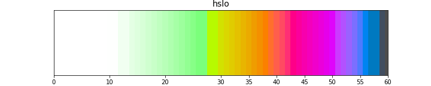
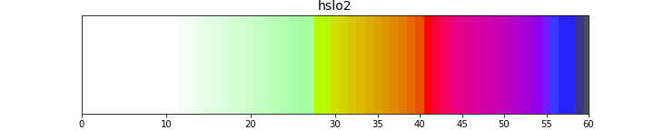

How to represent slopes in a way that his useful for mountain activities like hiking, ski-touring and alpinism?

Everyone has his own answer:

* French IGN and SwissTopo use just 4 colors: yellow/orange/red/purple for >30/35/40/45°
* [Sorbetto](https://tartamillo.wordpress.com/sorbetto/) uses:
> from 30 ° to 45 ° progressive transition from yellow to red
> from 45 ° to 50 ° uniform red
> over 50 ° uniform dark gray (in most cases it is actually cliffs)


OpenSlopeMap has an 8-color palette:
```python
  min   max    R   G   B     H   L   HTML  color
  0 °  -9 °    0   0   0     0 100   #FFFFFF  white
 10 ° -29 °    0 255   0   128  88   #00FF00  green
 30 ° -34 °  240 225   0    80  88   #F0E100  yellow
 35 ° -39 °  255 155   0    40  73   #FF9B00  orange
 40 ° -42 °  255   0   0    12  53   #FF0000  red
 43 ° -45 °  255  38 255   308  62   #FF26FF  magenta
 46 ° -49 °  167  25 255   282  47   #A719FF  violet
 50 ° -54 °  110   0 255   272  39   #6E00FF  purple
 55 ° -90 °    0   0 255   266  32   #0000FF  blue
```


Which I tweaked to make it continuous, in [gdaldem-slope-oslo.clr](geo/data/gdaldem-slope-oslo.clr).




<!--  -->

As I tweaked it more and more I realized I was trying to optimize perceptual difference across the palette, and that there were tools for that, like [HSLuv](https://www.hsluv.org/).

HSL stands for Hue / Saturation / Luminance, and in the gradients above we were actually decreasing *luminance* as slope increases, as well as cycling through *hues*:

```
slope  |    R    G    B |      H      S      L
------ | -------------- | --------------------
0      |  255  255  255 |    0.0    0.0  100.0
10     |  255  255  255 |    0.0    0.0  100.0
18     |  200  255  200 |  127.7  100.0   95.1
25     |  150  255  150 |  127.7  100.0   91.8
28     |   90  255   90 |  127.7  100.0   89.1
31     |  240  225    0 |   79.7  100.0   88.1
32     |  240  210    0 |   72.8  100.0   84.3
36     |  255  155    0 |   40.3  100.0   72.7
39     |  255  100    0 |   22.4  100.0   62.0
41     |  255    0    0 |   12.2  100.0   53.2
43     |  255   17  128 |  355.6  100.0   55.3
47     |  255   38  255 |  307.7  100.0   61.5
50     |  167   25  255 |  282.2  100.0   47.1
55     |  110    0  255 |  272.4  100.0   38.8
57     |    0    0  255 |  265.9  100.0   32.3
59.9   |    0    0  255 |  265.9  100.0   32.3
60     |   77   77   77 |    0.0    0.0   32.7
```

So what if we, instead, tried to compute a gradient directly in HSLuv space? Luckily all the hard work has been done for us in [Better Color Gradients with HSLuv](https://j.holmes.codes/20150808-better-color-gradients-with-hsluv/).




So far I found these only provide marginal improvement over the previous oslo palette, so I didn't use them.

Still the code is at <a href='geo/src/colorbar_hsluv.py'>colorbar_hsluv.py</a> if it's ever needed.
