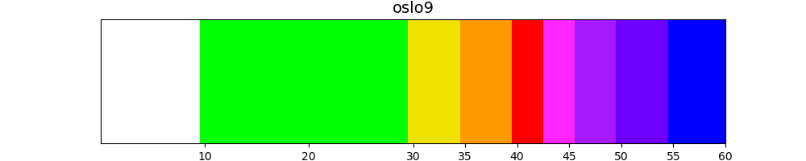
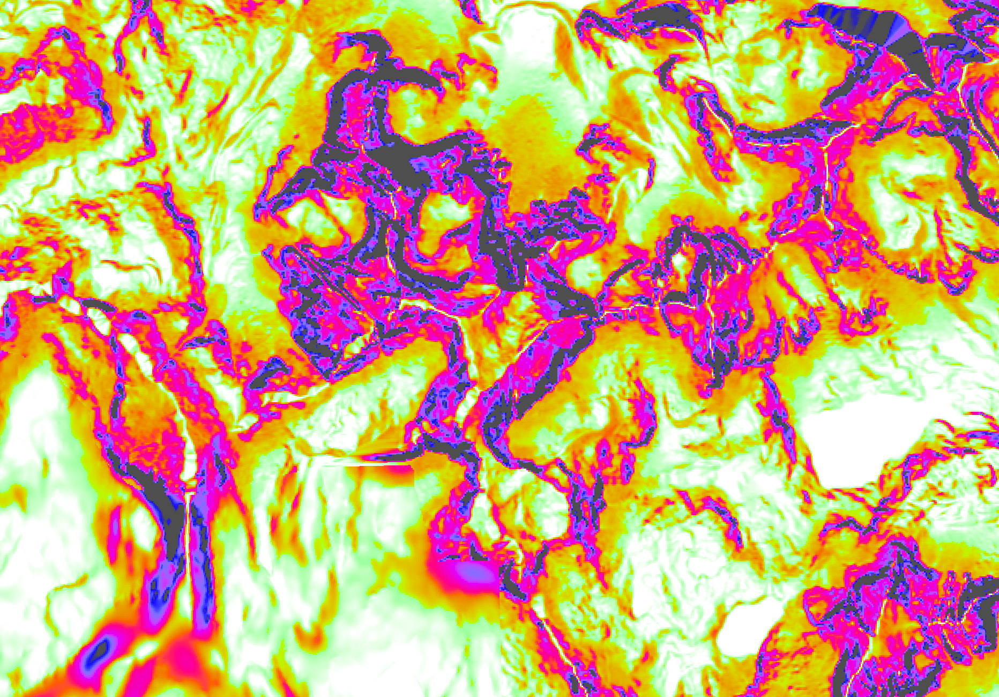
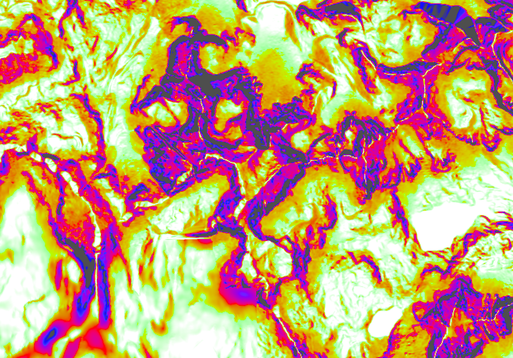
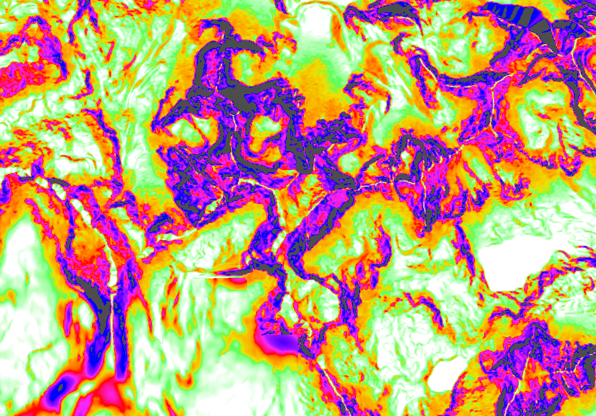
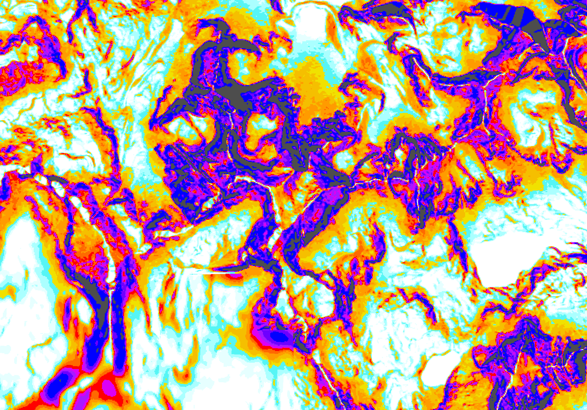

How to represent slopes in a way that his useful for mountain activities like hiking, ski-touring and alpinism?

# Existing palettes

Everyone has his own answer:

* French IGN and SwissTopo use just 4 colors: yellow/orange/red/purple for >30/35/40/45°
* [Sorbetto](https://tartamillo.wordpress.com/sorbetto/) uses:
> from 30 ° to 45 ° progressive transition from yellow to red
> from 45 ° to 50 ° uniform red
> over 50 ° uniform dark gray (in most cases it is actually cliffs)
* OpenSlopeMap has a 9-color palette (hereafter called *oslo9*)  which can be approximated with the following "center points" (closest wins): 0 white, 28 green, 32 yellow, 38 orange, 40 red, 42 magenta, 47 violet, 52 purple, 57 blue

```python:
  min   max    R   G   B     H   L   HTML  color
  0 °  -9 °    0   0   0     0 100   #FFFFFF  white
 10 ° -29 °    0 255   0   128  88   #00FF00  green
>29 ° -34 °  240 225   0    80  88   #F0E100  yellow
>34 ° -39 °  255 155   0    40  73   #FF9B00  orange
 40 ° -42 °  255   0   0    12  53   #FF0000  red
 43 ° -45 °  255  38 255   308  62   #FF26FF  magenta
 46 ° -49 °  167  25 255   282  47   #A719FF  violet
 50 ° -54 °  110   0 255   272  39   #6E00FF  purple
 55 ° -90 °    0   0 255   266  32   #0000FF  blue
```


# "oslo8", QGIS vs gdal palettes

The palette definition I got from an OpenSlopeMap dev is [this QGIS qml file](geo/data/OpenSlopeMap_Overlay_Style.qml) which is actually 8-color, as it foregoes the green band. The file is a QGIS *discrete color-ramp*.

> Discrete: the color is taken from the closest color map entry with equal or higher value *([source](https://docs.qgis.org/3.22/en/docs/pyqgis_developer_cookbook/raster.html))*

So each line reads as "if slope < *value* ..." and the cut-off point are actually: 29, 34, 39, 42, 44.5, 49.5, 54.5°, always pertaining to previous color eg 29° = green. Here is the corresponding gdal palette [oslo8ex](geo/data/gdaldem-slope-oslo8ex.clr).

The equivalent `-nearest_color_entry` palette [oslo8near](geo/data/gdaldem-slope-oslo8near.clr) would be centered on: 28 white, 30 yellow, 38 orange, 40 red, 44 magenta, 45-47 violet, 52 purple, 57 blue.

# "hslo"

I started from the oslo9 palette and tried to improve on it.

My idea was to make it continuous, and isolate a new 55-60° category, as in [cslo.clr](geo/data/gdaldem-slope-cslo.clr).

<br>


*(The palette plots are made with [colorbar.py](geo/src/colorbar.py))*

As I tweaked it more and more I realized I was trying to optimize perceptual difference across the palette, and that there were tools for that, like [HSLuv](https://www.hsluv.org/).

HSL stands for Hue / Saturation / Luminance, and in the gradients above we were actually decreasing *luminance* as slope increases, as well as cycling through *hues*:

```
slope  |    R    G    B |      H      S      L
------ | -------------- | --------------------
0      |  255  255  255 |    0.0    0.0  100.0
10     |  255  255  255 |    0.0    0.0  100.0
18     |  200  255  200 |  127.7  100.0   95.1
25     |  150  255  150 |  127.7  100.0   91.8
28     |   90  255   90 |  127.7  100.0   89.1
31     |  240  225    0 |   79.7  100.0   88.1
32     |  240  210    0 |   72.8  100.0   84.3
36     |  255  155    0 |   40.3  100.0   72.7
39     |  255  100    0 |   22.4  100.0   62.0
41     |  255    0    0 |   12.2  100.0   53.2
43     |  255   17  128 |  355.6  100.0   55.3
47     |  255   38  255 |  307.7  100.0   61.5
50     |  167   25  255 |  282.2  100.0   47.1
55     |  110    0  255 |  272.4  100.0   38.8
57     |    0    0  255 |  265.9  100.0   32.3
59.9   |    0    0  255 |  265.9  100.0   32.3
60     |   77   77   77 |    0.0    0.0   32.7
```

So what if we, instead, tried to compute a gradient directly in HSLuv space? Luckily all the hard work has been done for us in [Better Color Gradients with HSLuv](https://j.holmes.codes/20150808-better-color-gradients-with-hsluv/).

<br>
<br>


Code for the malinvern comparison samples:

```sh
cd TIL/img/geo/palette_compare/
extent='7.163085 44.182203 7.207031 44.213709'
gdalwarp -te_srs WGS84 -te $=extent ../alps/slopes-Lausanne-Jouques-Sanremo-Zermatt.tif slopes-malinvern.tif
gdaldem color-relief slopes-malinvern.tif ../../../geo/data/gdaldem-slope-hslo2.clr malinvern_s_hslo2.webp
```







So far I found these only provide marginal improvement over the previous oslo palette, so I didn't use them.

Still the code is at <a href='geo/src/colorbar_hsluv.py'>colorbar_hsluv.py</a> if it's ever needed.

# "eslo"

Even oslo provides arguably little improvement (or even a degradation of clarity), at the cost of additional storage space *(mitigated with PNG palette, but still, a 4-bit palette could be 50% smaller)*.

> Palette-based images, also known as colormapped or index-color images, use the PLTE chunk and are supported in four pixel depths: 1, 2, 4, and 8 bits, corresponding to a maximum of 2, 4, 16, or 256 palette entries.

Let's go back to the drawing board.
We want to:
* replace green as it's unclear on maps with green forests. Maybe light cyan, eg RGB 232 252 255 used for OpenTopoMap glaciers. For 22-28°
* separate the 55-60° category, adding grey (RGB 77  77  77) for >60°
* make magenta more distinct from red
*  cutoff points at .5°, to go well with an integer slope input.

... while still respecting the overall luminance ordering.

You can see the result as [eslo14.clr]("geo/data/gdaldem-slope-eslo14near.clr).

It has with more colors and cut off points
`19⁵ (24⁵) 28⁵ (31⁵) 34⁵ (37⁵) 40⁵ (43⁵) 46⁵ (49⁵) 53⁵ 59⁵` for
` cyan     yellow    orange    red       purple   blue grey`

```py
slope  nearest| R    G    B |      H     L | HTML     color
 0-14°  12 |  255  255  255 |      0   100 | #ffffff  white
15-19°  17 |  230  255  255 |    192    98 | #e6ffff  light cyan / bubbles
20-24°  22 |  170  255  255 |    192    95 | #aaffff  pale turquoise / celeste
25-28°  27 |   86  255  255 |    192    92 | #56ffff  cyan
29-31°  30 |  240  225    0 |     80    88 | #f0e100  titanium yellow
32-34°  33 |  245  191    0 |     61    80 | #f5bf00  golden poppy
35-37°  36 |  255  155    0 |     40    73 | #ff9b00  orange peel
38-40°  39 |  255  105    0 |     24    63 | #ff6900  dark orange 2
41-43°  42 |  255    0    0 |     12    53 | #ff0000  red
44-46°  45 |  220    0  245 |    299    54 | #dc00f5  magenta 2
47-49°  48 |  167   25  255 |    282    47 | #a719ff  purple
50-53°  51 |  110    0  255 |    272    39 | #6e00ff  electric indigo / violet
54-60°  56 |    0    0  255 |    266    32 | #0000ff  blue
61-90°  65 |   77   77   77 |      0    33 | #4d4d4d  gray 30

```

*([Find the Nearest Matching Color Name](https://shallowsky.com/colormatch/index.php) or https://www.color-name.com)*

Here is the colormap:

<br>
<br>


And let's wrap-up with the corresponding samples:




To use the palette follow the [IGN-data-gdaldem](202101-IGN-data-gdaldem.md) instructions to get the slopes file then run:
```sh
time gdaldem color-relief \
  slopes-Lausanne-Jouques-Sanremo-Zermatt.tif \
  /tmp/gdaldem-slope-oslo14w.clr \
  eslo14t-Lausanne-Jouques-Sanremo-Zermatt.mbtiles \
  -nearest_color_entry -co TILE_FORMAT=png8 -co BLOCKSIZE=1024
```
