How to represent slopes in a way that his useful for mountain activities like hiking, ski-touring and alpinism?

# Existing palettes

Everyone has his own answer:

* French IGN and SwissTopo use just 4 colors: yellow/orange/red/purple for >30/35/40/45°
* [Sorbetto](https://tartamillo.wordpress.com/sorbetto/) uses:
> from 30 ° to 45 ° progressive transition from yellow to red
> from 45 ° to 50 ° uniform red
> over 50 ° uniform dark gray (in most cases it is actually cliffs)
* OpenSlopeMap has a 9-color palette (hereafter called *oslo9*)  which can be approximated with the following "center points" (closest wins): 0 white, 28 green, 32 yellow, 38 orange, 40 red, 42 magenta, 47 violet, 52 purple, 57 blue

```python:
  min   max    R   G   B     H   L   HTML  color
  0 °  -9 °    0   0   0     0 100   #FFFFFF  white
 10 ° -29 °    0 255   0   128  88   #00FF00  green
>29 ° -34 °  240 225   0    80  88   #F0E100  yellow
>34 ° -39 °  255 155   0    40  73   #FF9B00  orange
 40 ° -42 °  255   0   0    12  53   #FF0000  red
 43 ° -45 °  255  38 255   308  62   #FF26FF  magenta
 46 ° -49 °  167  25 255   282  47   #A719FF  violet
 50 ° -54 °  110   0 255   272  39   #6E00FF  purple
 55 ° -90 °    0   0 255   266  32   #0000FF  blue
```
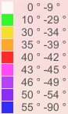

# "oslo8", QGIS vs gdal palettes

The palette definition I got from an OpenSlopeMap dev is [this QGIS qml file](data/OpenSlopeMap_Overlay_Style.qml) which is actually 8-color, as it foregoes the green band. The file is a QGIS *discrete color-ramp*.

> Discrete: the color is taken from the closest color map entry with equal or higher value *([source](https://docs.qgis.org/3.22/en/docs/pyqgis_developer_cookbook/raster.html))*

So each line reads as "if slope < *value* ..." and the cut-off point are actually: 29, 34, 39, 42, 44.5, 49.5, 54.5°, always pertaining to previous color eg 29° = green. Here is the corresponding gdal palette [oslo8ex](data/gdaldem-slope-oslo8ex.clr).

The equivalent `-nearest_color_entry` palette [oslo8near](data/gdaldem-slope-oslo8near.clr) would be centered on: 28 white, 30 yellow, 38 orange, 40 red, 44 magenta, 45-47 violet, 52 purple, 57 blue.

# "hslo"

I started from the oslo9 palette and tried to improve on it.

My idea was to make it continuous, and isolate a new 55-60° category, as in [cslo.clr](data/gdaldem-slope-cslo.clr).

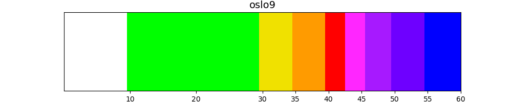<br>
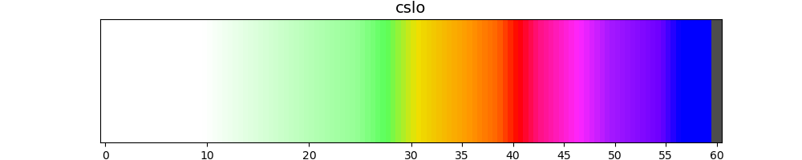

*(The palette plots are made with [colorbar.py](geo/src/colorbar.py))*

As I tweaked it more and more I realized I was trying to optimize perceptual difference across the palette, and that there were tools for that, like [HSLuv](https://www.hsluv.org/).

HSL stands for Hue / Saturation / Luminance, and in the gradients above we were actually decreasing *luminance* as slope increases, as well as cycling through *hues*:

```
slope  |    R    G    B |      H      S      L
------ | -------------- | --------------------
0      |  255  255  255 |    0.0    0.0  100.0
10     |  255  255  255 |    0.0    0.0  100.0
18     |  200  255  200 |  127.7  100.0   95.1
25     |  150  255  150 |  127.7  100.0   91.8
28     |   90  255   90 |  127.7  100.0   89.1
31     |  240  225    0 |   79.7  100.0   88.1
32     |  240  210    0 |   72.8  100.0   84.3
36     |  255  155    0 |   40.3  100.0   72.7
39     |  255  100    0 |   22.4  100.0   62.0
41     |  255    0    0 |   12.2  100.0   53.2
43     |  255   17  128 |  355.6  100.0   55.3
47     |  255   38  255 |  307.7  100.0   61.5
50     |  167   25  255 |  282.2  100.0   47.1
55     |  110    0  255 |  272.4  100.0   38.8
57     |    0    0  255 |  265.9  100.0   32.3
59.9   |    0    0  255 |  265.9  100.0   32.3
60     |   77   77   77 |    0.0    0.0   32.7
```

So what if we, instead, tried to compute a gradient directly in HSLuv space? Luckily all the hard work has been done for us in [Better Color Gradients with HSLuv](https://j.holmes.codes/20150808-better-color-gradients/).

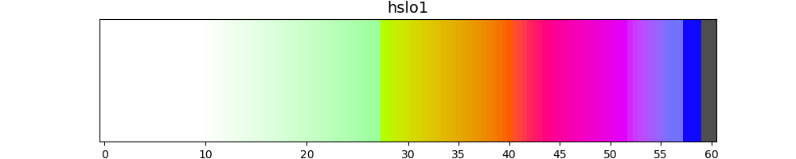<br>
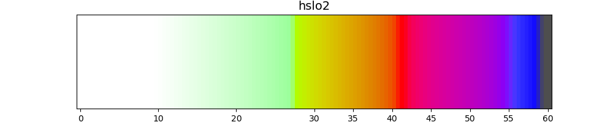<br>


Code for the malinvern comparison samples:

```sh
cd TIL/img/geo/palette_compare/
extent='7.163085 44.182203 7.207031 44.213709'
gdalwarp -te_srs WGS84 -te $=extent ../alps/slopes-Lausanne-Jouques-Sanremo-Zermatt.tif slopes-malinvern.tif
gdaldem color-relief slopes-malinvern.tif ../../../data/gdaldem-slope-hslo2.clr malinvern_s_hslo2.webp
```


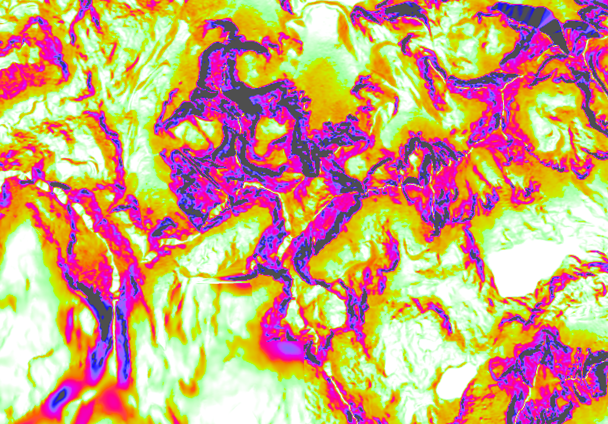
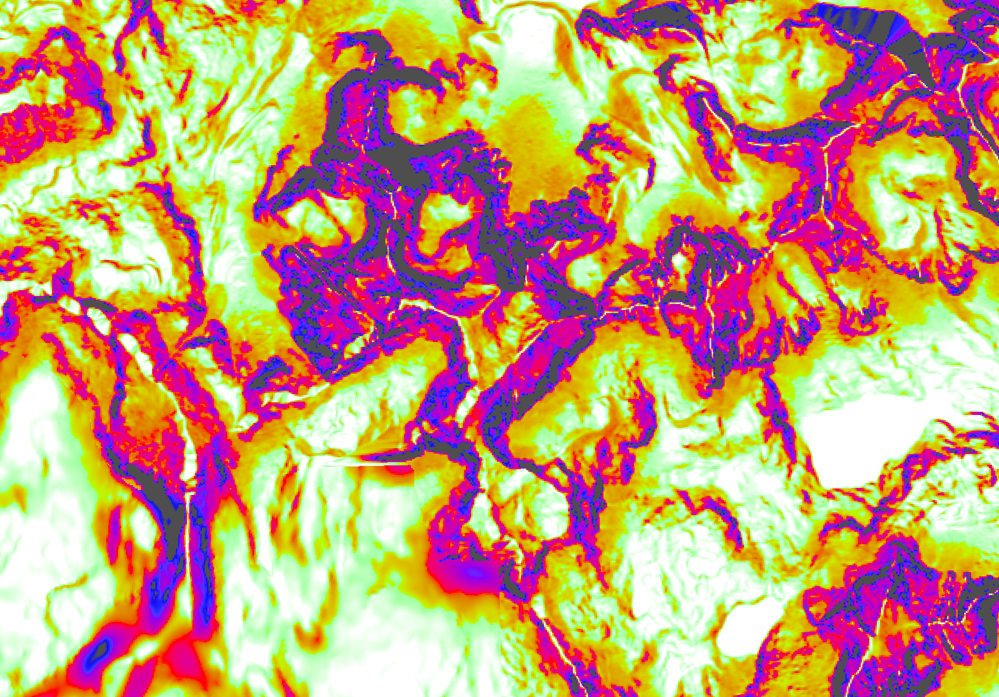
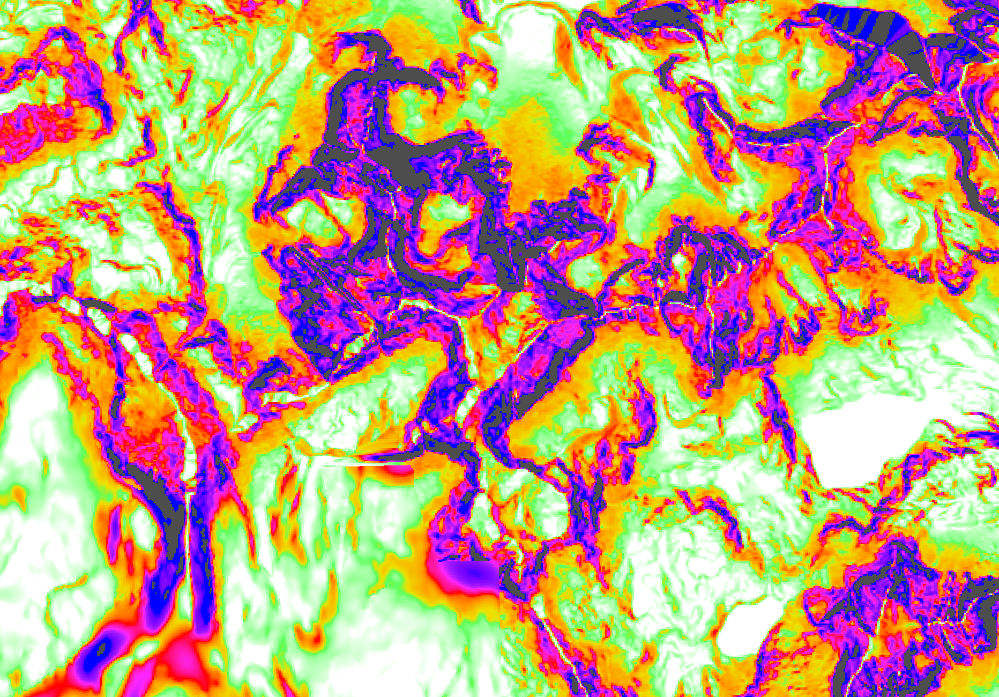


So far I found these only provide marginal improvement over the previous oslo palette, so I didn't use them.

Still the code is at <a href='geo/src/colorbar_hsluv.py'>colorbar_hsluv.py</a> if it's ever needed.

# "eslo"

Even oslo provides arguably little improvement (or even a degradation of clarity), at the cost of additional storage space *(mitigated with PNG palette, but still, a 4-bit palette could be 50% smaller)*.

> Palette-based images, also known as colormapped or index-color images, use the PLTE chunk and are supported in four pixel depths: 1, 2, 4, and 8 bits, corresponding to a maximum of 2, 4, 16, or 256 palette entries.

Let's go back to the drawing board.
We want to:
* __Show "gentle" slopes__, but not with green as it's unclear on maps with green forests. I'm using a cyan quite close to OpenTopoMap glaciers (which are RGB 232 252 255), but there are definitely less conflicts than with forests.
* __separate the 55-60° category__, adding grey (RGB 77  77  77) for >60°
* make magenta more distinct from red
* __cutoff points__ at .5°, to go well with an integer slope input (less temporary disk space ;)).
* at some point I considered having an even lower slope with `15-19°  17 |  230  255  255 |    192    98 | #e6ffff  light cyan / bubbles`. But this was invisible and not that useful. You can find it as [eslo14.clr]("data/gdaldem-slope-eslo14near.clr)

... while still respecting the overall luminance ordering.

You can see the result as [eslo13.clr]("data/gdaldem-slope-eslo13near.clr).

It has more colors and cut off points
`19⁵ (24⁵) 28⁵ (31⁵) 34⁵ (37⁵) 40⁵ (43⁵) 46⁵ (49⁵) 53⁵ 59⁵` for
` cyan     yellow    orange    red       purple   blue grey`

```py
slope  nearest| R    G    B |      H     L  | HTML     color
 0-19°  12 |  255  255  255 |      0   100  | #ffffff  white
20-24°  22 |  170  255  255 |    192    95  | #aaffff  pale turquoise / celeste
25-28°  27 |   86  255  255 |    192    92  | #56ffff  cyan
29-31°  30 |  240  225    0 |     80    88  | #f0e100  titanium yellow
32-34°  33 |  245  191    0 |     61    80  | #f5bf00  golden poppy
35-37°  36 |  255  155    0 |     40.3  72.7| #ff9b00  orange peel
38-40°  39 |  255  105    0 |     24    63  | #ff6900  dark orange 2
41-43°  42 |  255    0    0 |     12.2  53.2| #ff0000  red
44-46°  45 |  220    0  245 |    299.5  53.8| #dc00f5  magenta 2
47-49°  48 |  167   25  255 |    282    47  | #a719ff  purple
50-53°  51 |  110    0  255 |    272    39  | #6e00ff  electric indigo / violet
54-60°  56 |    0    0  255 |    266    32  | #0000ff  blue
61-90°  65 |   77   77   77 |      0    33  | #4d4d4d  gray 30

```

*([Find the Nearest Matching Color Name](https://shallowsky.com/colormatch/index.php) or https://www.color-name.com)*

Here is the colormap:

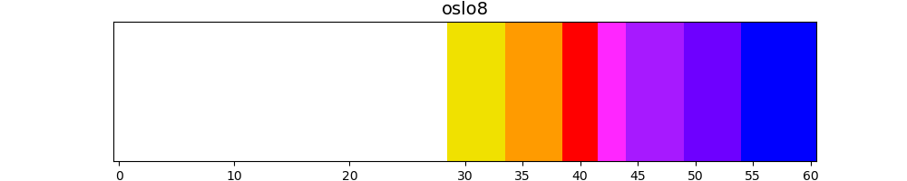<br>
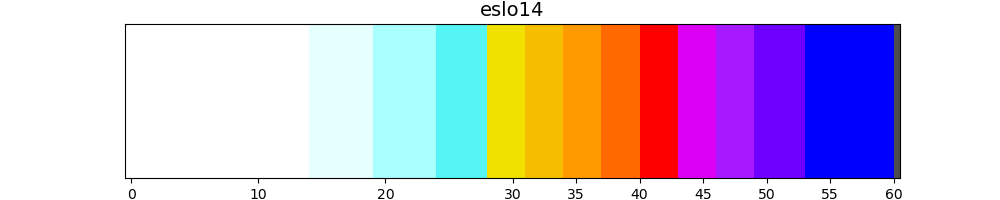<br>
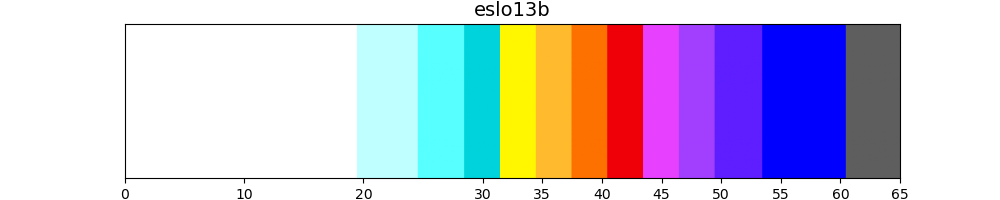<br>
<br>
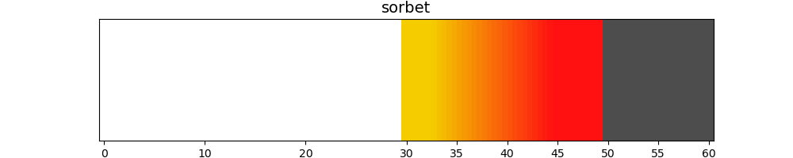

And let's wrap-up with the corresponding samples:

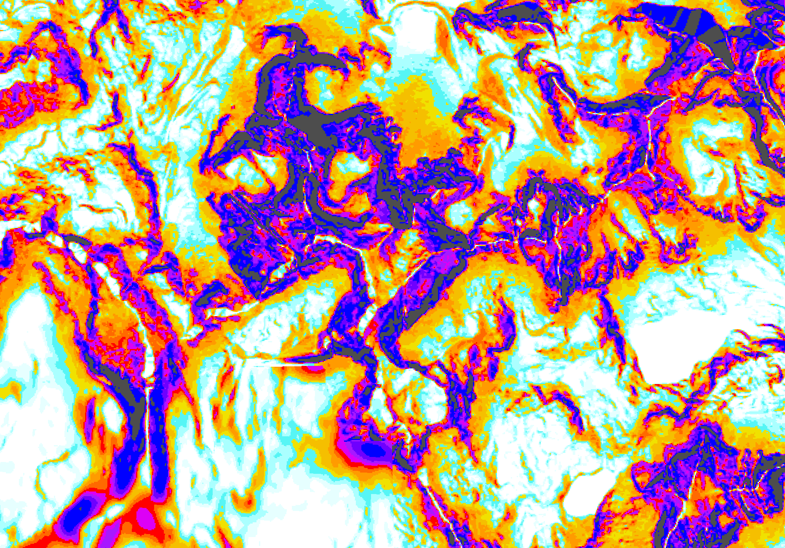


To use the palette follow the [IGN-data-gdaldem](202101-IGN-data-gdaldem.md) instructions to get the slopes file then run:
```sh
time gdaldem color-relief \
  slopes-Lausanne-Jouques-Sanremo-Zermatt.tif \
  /tmp/gdaldem-slope-oslo14w.clr \
  eslo14t-Lausanne-Jouques-Sanremo-Zermatt.mbtiles \
  -nearest_color_entry -co TILE_FORMAT=png8
```

# eslo: overview

The idea is to have a less disturbing but similar palette for overviews (lower zoom-levels).
## Note on PNG8 in GDAL

My idea was to keep a few of the same colors, and play with transparency. However:

> at that time, such an 8-bit PNG formulation is **only used for fully opaque tiles** [...] even if PNG8 format would potentially allow color table with transparency.

... so, with transparency, file size will grow uselessly. But actually, since we use blend-multiply, we don't need true transparency, because given an overlay color "R G B" the following are equivalent:
* add X% transparency then blend
* average R, G, B with white ie 255 (weighted-average by 100-X%), then blend

I applied this formula for an equivalent 60% transparency to the "golden poppy", "magenta 2" and grey from above, again:
34.5     245 191   0 170
44.5     220   0 245 170
54.5      77  77  77 170

Which gives the colors below. This is the basis for [eslo4near](data/gdaldem-slope-eslo4near.clr), that I use at zoom levels 13 and 14.
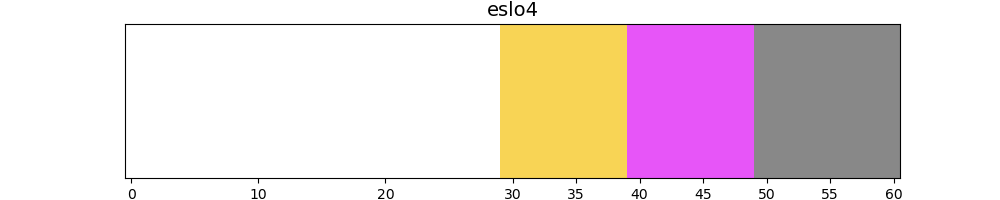

| Slope  | nearest |  R  |  G  |  B  |   H  |   S  |   L  | HTML    |
| ------ | ------- | --- | --- | --- |  --- |  --- |  --- |  ---    |
|  0-30° | 24.5    | 255 | 255 | 255 |  0   |  0   |100   | #FFFFFF |
| 30-40° | 34.5    | 248 | 212 |  85 | 68.2 | 84.6 | 85.9 | #F8D455 |
| 40-50° | 44.5    | 231 | 85  | 248 |301.5 | 93.5 | 61.9 | #E755F8 |
| 50-90° | 54.5    | 136 | 136 | 136 |  0   |  0   | 56   |

_Note: [htmlcolorcodes](https://htmlcolorcodes.com/fr/rgb-a-hex/?r=231&g=85&b=248) was of some help to build this table.

# 2024 edits

Previous palette, reverse engineered:
but the code says I used eslo13near, which is:
```
17 |  255 255 255 |   0.0   0.0% 100.0%  | #ffffff | white
22 |  170 255 255 | 192.2 100.0%  94.9%  | #aaffff | light cyan
27 |   86 245 245 | 192.2  87.7%  88.9%  | #56f5f5 | bright cyan
30 |  240 225   0 |  79.7 100.0%  88.1%  | #f0e100 | dandelion
33 |  245 191   0 |  61.1 100.0%  80.0%  | #f5bf00 | golden
36 |  255 155   0 |  40.3 100.0%  72.7%  | #ff9b00 | tangerine
39 |  255 105   0 |  23.5 100.0%  62.8%  | #ff6900 | bright orange
42 |  255   0   0 |  12.2 100.0%  53.2%  | #ff0000 | fire engine red
45 |  220   0 245 | 299.5 100.0%  53.8%  | #dc00f5 | hot purple
48 |  167  25 255 | 282.2 100.0%  47.1%  | #a719ff | electric purple
51 |  110   0 255 | 272.4 100.0%  38.8%  | #6e00ff | purplish blue
56 |    0   0 255 | 265.9 100.0%  32.3%  | #0000ff | rich blue
65 |   77  77  77 |   0.0   0.0%  32.7%  | #4d4d4d | charcoal grey
nv |    0   0   0 |   0.0   0.0%   0.0%  | #000000 | black
```

```py
slope  nearest| R    G    B |      H     L  | HTML     color
 0-19°  12 |  255  255  255 |      0   100  | #ffffff  white
20-24°  22 |  170  255  255 |    192    95  | #aaffff  pale turquoise / celeste
25-28°  27 |   86  245  245 |    192    92  | #56ffff  cyan
29-31°  30 |  254 254    80 |     90    97  | #fefe50  titanium yellow before 80 88
32-34°  33 |  245  191    0 |     65    87  | #f5bf00  golden poppy   befor 61 80
35-37°  36 |  255  155    0 |     45    76  | #ff9b00  orange peel  was 40.3  72.7
38-40°  39 |  255  105    0 |     24    65  | #ff6900  dark orange 2 was 24    63
41-43°  42 |  255    0    0 |     12    53  | #ff0000  red
44-46°  45 |  220    0  245 |    300    60  | #dc00f5  magenta 2  299.5  53.8
47-49°  48 |  167   25  255 |    280    50  | #a719ff  purple    282    47
50-53°  51 |  110    0  255 |    270    39  | #6e00ff  electric indigo / violet    272    39
54-57°  54 |   65    6  255 |    268    35  | #4106ff  blue1
58-64°  59 |    0    0  255 |    266    32  | #0000ff  blue
65-90°  68 |   89   89   89 |      0    38  | #595959  gray 30

```

Goals for the new palette

"30" should be made *much* lighter and yellower to be less scary, as avalanches are quite unlikely at this point ; to be make the 33 class standout

33 - 36 - 39 should also start a bit lighter to space them out better as this is the most frequent ski terrain.

45 can be lighter as well, as it's already quite distinct from 42, to better differentiate it from 45

still 3 blue, 3 orange , red, 4 purple, grey

## eslo13bnear

eslo13b near is the one from 2024, this is parsed from mbtiles (in norway.ipynb) :
```css
 0-19°  17 |  255 255 255 |   0.0   0.0% 100.0%  | #ffffff | white
20-24°  22 |  192 255 255 | 192.2 100.0%  96.0%  | #c0ffff | light sky blue
25-28°  27 |   87 255 255 | 192.2 100.0%  92.0%  | #57ffff | bright cyan
29-31°  30 |    0 211 219 | 198.4 100.0%  77.1%  | #00d3db | aqua blue
32-34°  33 |  255 247   0 |  82.9 100.0%  95.1%  | #fff700 | sunny yellow
35-37°  36 |  255 187  45 |  54.0 100.0%  80.2%  | #ffbb2d | orangey yellow
38-40°  39 |  253 113   0 |  25.9 100.0%  63.9%  | #fd7100 | orange
41-43°  42 |  239   0   8 |  12.0 100.0%  49.9%  | #ef0008 | cherry red
44-46°  45 |  232  64 255 | 300.0 100.0%  59.9%  | #e840ff | heliotrope
47-49°  48 |  162  63 255 | 279.9 100.0%  50.0%  | #a23fff | electric purple
50-53°  51 |   94  30 255 | 270.0 100.0%  38.8%  | #5e1eff | purplish blue
54-57°  56 |    0   0 255 | 265.9 100.0%  32.3%  | #0000ff | rich blue
58-64°  65 |   94  94  94 |   0.0   0.0%  39.9%  | #a9a9a9ff | gunmetal
65-90°  nv |    0   0   0 |   0.0   0.0%   0.0%  | #000000 | black
```
# 2026 edits: eslo13cnear

With tweaks:
```css
slope nearest| R    G   B |     H      S      L  |   HTML    | color
 0-19°  16 |  255 255 255 |   0.0   0.0% 100.0%  | #ffffff | white
19-23°  21 |  192 255 255 | 192.2 100.0%  96.0%  | #c0ffff | light sky blue
24-27°  26 |   87 255 255 | 192.2 100.0%  92.0%  | #57ffff | bright cyan
28-30°  29 |    0 211 219 | 198.4 100.0%  77.1%  | #00d3db | aqua blue
31-33°  32 |  255 250  50 |  84.0 100.0%  95.9%  | #fffa32 | sunshine yellow
34-36°  35 |  255 194  86 |  54.8 100.0%  82.1%  | #ffc256 | macaroni and cheese
37-39°  38 |  253 113   0 |  25.9 100.0%  63.9%  | #fd7100 | orange
40-42°  41 |  256   0   0 |   0   100.0%  50.0%  | #ff0000 | fire red
43-46°  44 |  233  88 255 | 299.9 100.0%  62.9%  | #e958ff | heliotrope
47-51°  49 |  166  80 255 | 279.9 100.0%  53.0%  | #a650ff | lighter purple
52-56°  54 |   94  30 255 | 270.0 100.0%  38.8%  | #5e1eff | purplish blue
57-63°  59 |    0   0 255 | 265.9 100.0%  32.3%  | #0000ff | rich blue
64-90°  68 |  170 170 170 |   0.0   0.0%  69.6%  | #aaaaaa | cool grey
noval   nv |    0   0   0 |   0.0   0.0%   0.0%  | #000000 | black
```

```py
 [
 #ffffff,
20, #c0ffff,
24, #57ffff,
28, #00d3db,
31, #fffa32,
34, #ffc256,
37, #fd7100,
40, #ef0008,
43, #e958ff,
47, #a650ff,
52, #5e1eff,
57, #0000ff,
62, #aaaaaa,
 ]
```


## eslo4near adjustment towards steeper slopes

| Slope  | nearest |  R  |  G  |  B  |   H  |   S  |   L  | HTML    |
| ------ | ------- | --- | --- | --- |  --- |  --- |  --- |  ---    |
|  0-30° | 24.5    | 255 | 255 | 255 |  0   |  0   |100   | #FFFFFF |
| 30-43° | 34.5    | 248 | 212 |  85 | 68.2 | 84.6 | 85.9 | #F8D455 |
| 43-55° | 50.5    | 231 | 85  | 248 |301.5 | 93.5 | 61.9 | #E755F8 |
| 55-90° | 60.5    | 136 | 136 | 136 |  0   |  0   | 56   |
